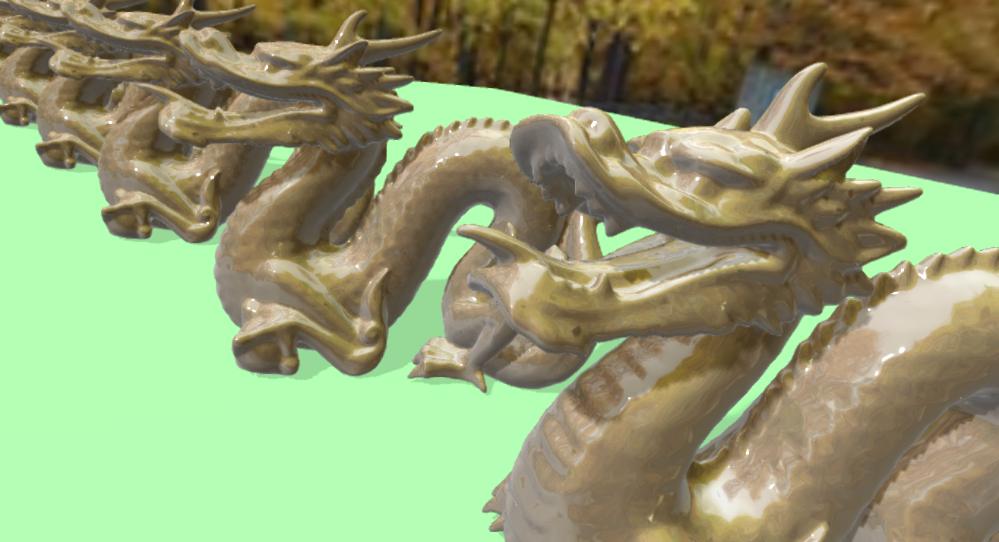

## EngineCPP
Game engine written in C++



### Building

Clone the repo:
```
$ git clone https://github.com/DCubix/engine-cpp
```

#### Linux

Building on Linux is pretty straight-forward.

- Simply get the dependencies.

##### Arch:
```
$ sudo pacman -S sdl2 assimp bullet physfs
```

##### Ubuntu:
```
$ sudo apt-get libsdl2-dev libsdl2-2.0-0 libassimp-dev libassimp4 libphysfs-dev libphysfs1 libbullet-dev libbullet2.87
```

- Then just run CMake, generate Unix Make Files and just make it.
```bash
$ mkdir build
$ cd build
$ cmake -G "Unix MakeFiles" -DCMAKE_BUILD_TYPE=Debug(or Release) ..
$ ...
$ make -j2
```

#### Mac

TODO! (Need Help)

#### Windows

On Windows, you have to install CMake-GUI. And get the respective libraries for your compiler:

	1. SDL2: https://www.libsdl.org/download-2.0.php
	2. Assimp: https://github.com/assimp/assimp/releases
	3. PhysFS: https://icculus.org/physfs/
	4. Bullet: https://github.com/bulletphysics/bullet3/releases/tag/2.85.1

- Then open CMake-GUI, set the `Source code` path to the repository root (where the CMakeLists.txt resides)
and set the `build` path to the build folder (create it!).

- Click `Configure` and pick the desired compiler (Visual Studio XX if you picked the VS libraries or
MSYS/MinGW Makefiles if you picked the MinGW libraries) and then click `Finish`.

- An error should appear telling you the libraries were not found. In this case, set all library paths accordingly.

- Now click `Configure` again and then `Generate`.

- Build the project with MinGW, MSYS or Visual Studio.
